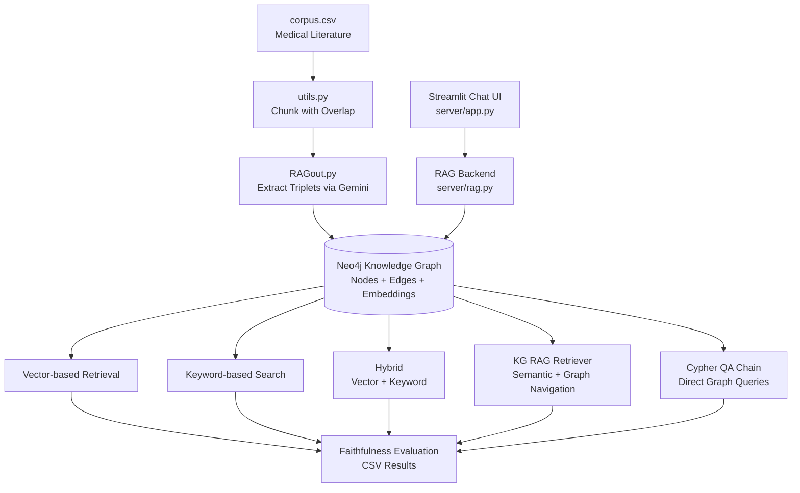
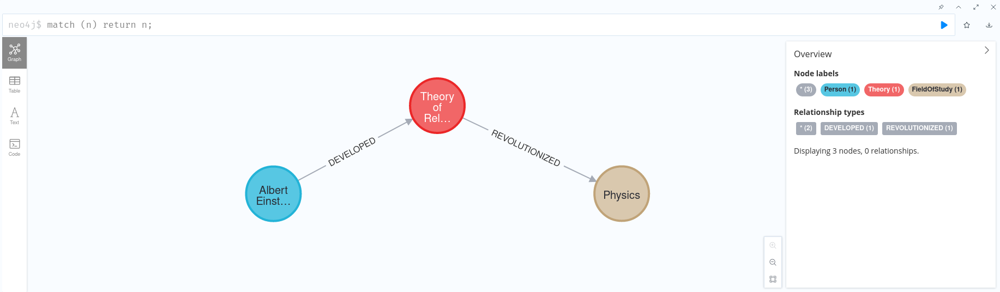

*[Leia em Português (original)](README.pt-BR.md)*

# Doctor RAG

Knowledge Graph-based Retrieval-Augmented Generation (RAG) system for medical literature analysis. Built as part of the master's thesis: **"Mineração de Texto, Inteligência Artificial e Aplicações em Biotecnologia"**.

The system extracts structured knowledge (entity-relationship triplets) from a medical corpus about **Vitamin D and COVID-19**, stores it in a Neo4j graph database, and provides multiple query strategies to answer medical questions with faithfulness evaluation.

## Architecture



## Project Structure

```
doctor_rag/
├── RAGout.py              # Main pipeline: builds KG and evaluates query strategies
├── clinical_features_extraction.py  # John Snow Labs NER/RE extraction pipelines
├── study_pandas.py        # Bibliography data processing (Web of Science)
├── qa_chain.py            # Multi-database Cypher QA (OpenAI gpt-3.5-turbo)
├── qa_index_chain.py      # Multi-strategy evaluation across databases
├── load_data.py           # Loads graph data from CSV into Neo4j
├── utils.py               # Chunking utilities (overlap, whole-document, deduplication)
├── corpus.csv             # Medical literature corpus (sentences)
├── catalog.csv            # Publication metadata catalog
├── docker-compose.yaml    # Neo4j 5.15 container setup
├── requirements.txt       # Python dependencies
├── environment.yml        # Conda environment
├── .env.example           # Required environment variables
├── biblio.bib             # BibTeX bibliography
├── er_diagram.png         # Entity-relationship diagram
├── 10.2.Clinical_RE_Knowledge_Graph_with_Neo4j.ipynb  # Spark NLP clinical RE notebook
├── server/
│   ├── app.py             # Streamlit chat interface
│   ├── rag.py             # RAG backend (Ollama + Neo4j + LangChain)
│   ├── match.py           # Example Neo4j Cypher graph structure
│   └── graph_neo4j.png    # Knowledge graph visualization
```

## Prerequisites

- Python 3.12
- [Neo4j](https://neo4j.com/) (5.15+)
- [Ollama](https://ollama.ai/) with `mistral` model (for the server component)
- API keys for Google Gemini and/or OpenAI

## Setup

### 1. Clone and install dependencies

```bash
git clone https://github.com/vriez/doctor_rag.git
cd doctor_rag
pip install -r requirements.txt
```

Or with conda:

```bash
conda env create -f environment.yml
conda activate doctor_rag
```

### 2. Start Neo4j

```bash
docker compose up -d
```

### 3. Configure environment variables

```bash
cp .env.example .env
```

Edit `.env` with your credentials:

```env
NEO4J_URL=bolt://localhost:7687
NEO4J_USERNAME=neo4j
NEO4J_PASSWORD=your-secure-password

# For RAGout.py and qa_index_chain.py
GOOGLE_API_KEY=your-google-api-key

# For qa_chain.py and server (if using OpenAI models)
OPENAI_API_KEY=your-openai-api-key

# For multi-database scripts (qa_chain.py, qa_index_chain.py)
# NEO4J_AUTH_MAP='{"db_id": {"username": "neo4j", "password": "...", "url": "bolt://..."}}'
```

## Usage

### Build the Knowledge Graph

```bash
python RAGout.py <PASSWORD> <URL> <DB_ID> <OVERLAP> <EXP_TAG> <CHUNK_SIZE> <MAX_TRIPLETS>
```

Example:

```bash
python RAGout.py mypassword bolt://localhost:7687 mydb 50 experiment1 4096 10
```

This will:
1. Read `corpus.csv` and chunk the text with the specified overlap
2. Extract triplets using Google Gemini
3. Store nodes, edges, and embeddings in Neo4j
4. Evaluate 5 query strategies on 17 multilingual test questions
5. Output results to a CSV with faithfulness scores

### Run the Chat Interface

```bash
cd server
streamlit run app.py
```

Upload a PDF and ask questions through the web interface. The server uses Ollama (mistral) for embeddings and Q&A, with OpenAI (gpt-4) for Cypher query generation.

### Run Multi-Database Evaluation

Set `NEO4J_AUTH_MAP` in your `.env`, then:

```bash
python qa_chain.py          # Cypher QA with OpenAI
python qa_index_chain.py    # Multi-strategy evaluation with Gemini
```

## Models Used

| Component | Model | Provider |
|-----------|-------|----------|
| Triplet extraction & QA | Gemini 1.0 Pro | Google |
| Embeddings | Gemini Embedding-001 | Google |
| Cypher generation | gpt-3.5-turbo / gpt-4 | OpenAI |
| Local LLM & embeddings | Mistral | Ollama |
| Clinical NER/RE pipelines | Spark NLP Healthcare | John Snow Labs |

> **Note:** The thesis originally used Mistral (local, via Ollama) as the primary LLM for triplet extraction, chosen over gpt-3.5-turbo due to cost constraints. The codebase later evolved to use Google Gemini for this role in `RAGout.py`, while Mistral remains in the server component (`server/rag.py`).

## Query Strategies

The system evaluates five retrieval approaches:

| Strategy | Description |
|----------|-------------|
| **Vector** | Semantic similarity over embedded graph nodes |
| **Keyword** | Graph keyword matching with tree summarization |
| **Hybrid** | Combined vector + keyword retrieval |
| **KG RAG** | Semantic retrieval with synonym expansion and graph navigation |
| **Cypher Chain** | LLM generates Cypher queries directly against the graph |

Each strategy is tested with varying parameters (`include_text`, `verbose`, `explore_global_knowledge`) and scored using a faithfulness evaluator.

## Reproducibility

### Environment

| Dependency | Version |
|------------|---------|
| Python | 3.12.2 |
| llama-index-core | 0.10.26 |
| langchain | 0.1.13 |
| neo4j (driver) | 5.18.0 |
| Neo4j (server, Docker) | 5.15.0 |
| google-generativeai | 0.3.2 |
| openai | 1.14.2 |
| torch | 2.2.2 |
| streamlit | 1.31.0 |

Full pinned versions in [environment.yml](environment.yml) and [requirements.txt](requirements.txt).

### Corpus

- **File:** `corpus.csv` (columns: `id`, `fname`, `text`)
- **Rows:** 30,851
- **Content:** Medical literature sentences on Vitamin D and COVID-19

### Model Configuration

| Component | Model | Temperature |
|-----------|-------|-------------|
| Triplet extraction / QA | `models/gemini-1.0-pro` | 0.0 |
| Embeddings | `models/embedding-001` | 0.0 |
| Cypher generation (qa_chain) | `gpt-3.5-turbo` | 0.0 |
| Evaluation | `FaithfulnessEvaluator` (Gemini) | — |

### Experiment Parameters (RAGout.py)

Passed as CLI arguments: `PASSWORD`, `URL`, `DB_ID`, `OVERLAP`, `EXP_TAG`, `CHUNK_SIZE`, `MAX_TRIPLETS`.

Fixed parameters in code:

| Parameter | Value |
|-----------|-------|
| `edge_types` | `["relationship"]` |
| `rel_prop_names` | `["relationship"]` |
| `tags` | `["entity"]` |
| `include_embeddings` | `True` |
| `timeout` | 100s |

### Evaluation Matrix

The project has two evaluation phases:

**Phase 1 — Knowledge Graph construction** (`clinical_features_extraction.py`): 4 chunk sizes x 3 overlaps x 2 clean modes x 4 pipelines = **96 KG experiments**, as described in the thesis (Tabela 2.1).

**Phase 2 — Query evaluation** (`RAGout.py`): 6 strategies x 4 parameter sets x 17 questions = **408 evaluations**:

Strategies: `vector_based`, `keyword-based`, `hybrid`, `rag`, `graph`, `chain`

Parameter combinations (`INCLUDE_TEXT`, `VERBOSE`, `GLOBAL`):

| Set | INCLUDE_TEXT | VERBOSE | GLOBAL |
|-----|-------------|---------|--------|
| 1 | True | True | True |
| 2 | False | True | False |
| 3 | True | True | False |
| 4 | False | False | False |

**qa_index_chain.py** evaluates 5 strategies x 4 parameter sets x 17 questions = **340 evaluations**.

### Test Questions

The thesis originally defined 3 validation questions (direct relations, relations with references, and a negative control — "Quem e Silvio Santos?"). The codebase expands this to 17 multilingual questions (6 English, 5 Portuguese, 4 Spanish, 2 negative controls).

### Output File Naming

```
# Knowledge graph storage
./storage_graph_{DB_ID}_{EXP_TAG}_{MAX_TRIPLETS}__{CHUNK_SIZE}

# Evaluation results
qa_{GLOBAL}_{VERBOSE}_{DB_ID}__{INCLUDE_TEXT}_{CHUNK_SIZE}_{MAX_TRIPLETS}_{OVERLAP}.csv

# Extracted triplets
triplets_{DB_ID}_{EXP_TAG}_{MAX_TRIPLETS}__{CHUNK_SIZE}.csv
```

## Sample Output

Knowledge graph visualization in Neo4j Browser showing extracted entity relationships:



The system outputs evaluation CSVs with the following columns:

| db | strategy | question | answer | eval | time |
|----|----------|----------|--------|------|------|
| `db_id` | `hybrid__0` | What is vitamin D deficiency? | Vitamin D deficiency is a condition... | 0.85 | 3.2s |

## Citation

If you use this work in your research, please cite:

```bibtex
@mastersthesis{reis2024doctorrag,
  title     = {Minera\c{c}\~ao de Texto, Intelig\^encia Artificial e Aplica\c{c}\~oes em Biotecnologia},
  author    = {Reis, Vitor Eul\'alio},
  year      = {2024},
  school    = {Universidade Federal de S\~ao Carlos (UFSCar)},
  type      = {Master's thesis}
}
```

## Acknowledgments

- **Advisor:** Prof.ª Dr.ª Ignez Caracelli
- **Institution:** Universidade Federal de São Carlos (UFSCar) — Programa de Pós-Graduação em Biotecnologia
- **Funding:** CAPES (Coordenação de Aperfeiçoamento de Pessoal de Nível Superior)

## License

This project is licensed under the [MIT License](LICENSE).
