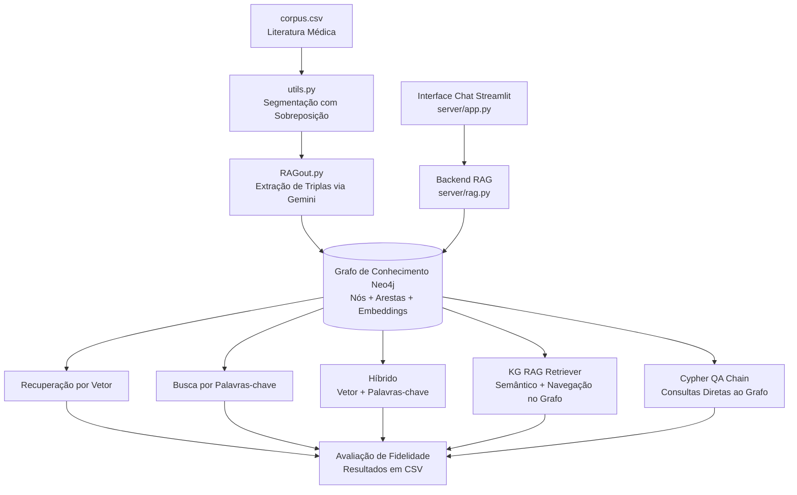

*[Read in English](README.md)*

# Doctor RAG

Sistema de Geração Aumentada por Recuperação (RAG) baseado em Grafo de Conhecimento para análise de literatura médica. Desenvolvido como parte da dissertação de mestrado: **"Uso da Inteligência Artificial na Procura de Relações entre COVID-19 e Vitamina D"**.

O sistema extrai conhecimento estruturado (triplas entidade-relacionamento) de um corpus médico sobre **Vitamina D e COVID-19**, armazena em um banco de dados de grafos Neo4j e oferece múltiplas estratégias de consulta para responder perguntas médicas com avaliação de fidelidade.

## Arquitetura



## Estrutura do Projeto

```
doctor_rag/
├── RAGout.py              # Pipeline principal: constrói o KG e avalia estratégias
├── clinical_features_extraction.py  # Pipelines de extração NER/RE (John Snow Labs)
├── study_pandas.py        # Processamento de dados bibliográficos (Web of Science)
├── qa_chain.py            # QA Cypher multi-banco (OpenAI gpt-3.5-turbo)
├── qa_index_chain.py      # Avaliação multi-estratégia entre bancos
├── load_data.py           # Carrega dados do CSV para o Neo4j
├── utils.py               # Utilitários de segmentação (sobreposição, deduplicação)
├── corpus.csv             # Corpus de literatura médica (sentenças)
├── catalog.csv            # Catálogo de metadados das publicações
├── docker-compose.yaml    # Configuração do contêiner Neo4j 5.15
├── requirements.txt       # Dependências Python
├── environment.yml        # Ambiente Conda
├── .env.example           # Variáveis de ambiente necessárias
├── 10.2.Clinical_RE_Knowledge_Graph_with_Neo4j.ipynb  # Notebook Spark NLP de RE clínica
├── server/
│   ├── app.py             # Interface chat Streamlit
│   ├── rag.py             # Backend RAG (Ollama + Neo4j + LangChain)
│   ├── match.py           # Estrutura de exemplo em Cypher para o Neo4j
│   └── graph_neo4j.png    # Visualização do grafo de conhecimento
```

## Pré-requisitos

- Python 3.12
- [Neo4j](https://neo4j.com/) (5.15+)
- [Ollama](https://ollama.ai/) com o modelo `mistral` (para o componente server)
- Chaves de API do Google Gemini e/ou OpenAI

## Instalação

### 1. Clone e instale as dependências

```bash
git clone https://github.com/vriez/doctor_rag.git
cd doctor_rag
pip install -r requirements.txt
```

Ou com conda:

```bash
conda env create -f environment.yml
conda activate doctor_rag
```

### 2. Inicie o Neo4j

```bash
docker compose up -d
```

### 3. Configure as variáveis de ambiente

```bash
cp .env.example .env
```

Edite o `.env` com suas credenciais:

```env
NEO4J_URL=bolt://localhost:7687
NEO4J_USERNAME=neo4j
NEO4J_PASSWORD=sua-senha-segura

# Para RAGout.py e qa_index_chain.py
GOOGLE_API_KEY=sua-chave-google

# Para qa_chain.py e server (se usar modelos OpenAI)
OPENAI_API_KEY=sua-chave-openai

# Para scripts multi-banco (qa_chain.py, qa_index_chain.py)
# NEO4J_AUTH_MAP='{"db_id": {"username": "neo4j", "password": "...", "url": "bolt://..."}}'
```

## Uso

### Construir o Grafo de Conhecimento

```bash
python RAGout.py <SENHA> <URL> <DB_ID> <SOBREPOSIÇÃO> <TAG_EXP> <TAM_BLOCO> <MAX_TRIPLAS>
```

Exemplo:

```bash
python RAGout.py minhasenha bolt://localhost:7687 meubanco 50 experimento1 4096 10
```

Isso irá:
1. Ler o `corpus.csv` e segmentar o texto com a sobreposição especificada
2. Extrair triplas usando o Google Gemini
3. Armazenar nós, arestas e embeddings no Neo4j
4. Avaliar 5 estratégias de consulta em 17 perguntas de teste multilíngues
5. Gerar resultados em CSV com pontuações de fidelidade

### Executar a Interface de Chat

```bash
cd server
streamlit run app.py
```

Faça upload de um PDF e faça perguntas pela interface web. O servidor usa Ollama (mistral) para embeddings e QA, com OpenAI (gpt-4) para geração de consultas Cypher.

### Executar Avaliação Multi-Banco

Configure `NEO4J_AUTH_MAP` no seu `.env` e execute:

```bash
python qa_chain.py          # QA Cypher com OpenAI
python qa_index_chain.py    # Avaliação multi-estratégia com Gemini
```

## Modelos Utilizados

| Componente | Modelo | Provedor |
|------------|--------|----------|
| Extração de triplas e QA | Gemini 1.0 Pro | Google |
| Embeddings | Gemini Embedding-001 | Google |
| Geração de Cypher | gpt-3.5-turbo / gpt-4 | OpenAI |
| LLM e embeddings locais | Mistral | Ollama |

## Estratégias de Consulta

O sistema avalia cinco abordagens de recuperação:

| Estratégia | Descrição |
|------------|-----------|
| **Vetor** | Similaridade semântica sobre nós embarcados do grafo |
| **Palavras-chave** | Busca por palavras-chave com sumarização em árvore |
| **Híbrido** | Recuperação combinada vetor + palavras-chave |
| **KG RAG** | Recuperação semântica com expansão de sinônimos e navegação no grafo |
| **Cypher Chain** | LLM gera consultas Cypher diretamente contra o grafo |

Cada estratégia é testada com parâmetros variados (`include_text`, `verbose`, `explore_global_knowledge`) e avaliada usando um avaliador de fidelidade.

## Reprodutibilidade

### Ambiente

| Dependência | Versão |
|-------------|--------|
| Python | 3.12.2 |
| llama-index-core | 0.10.26 |
| langchain | 0.1.13 |
| neo4j (driver) | 5.18.0 |
| Neo4j (servidor, Docker) | 5.15.0 |
| google-generativeai | 0.3.2 |
| openai | 1.14.2 |
| torch | 2.2.2 |
| streamlit | 1.31.0 |

Versões completas fixadas em [environment.yml](environment.yml) e [requirements.txt](requirements.txt).

### Corpus

- **Arquivo:** `corpus.csv` (colunas: `id`, `fname`, `text`)
- **Linhas:** 30.851
- **Conteúdo:** Sentenças de literatura médica sobre Vitamina D e COVID-19

### Configuração dos Modelos

| Componente | Modelo | Temperatura |
|------------|--------|-------------|
| Extração de triplas / QA | `models/gemini-1.0-pro` | 0.0 |
| Embeddings | `models/embedding-001` | 0.0 |
| Geração de Cypher (qa_chain) | `gpt-3.5-turbo` | 0.0 |
| Avaliação | `FaithfulnessEvaluator` (Gemini) | — |

### Parâmetros do Experimento (RAGout.py)

Passados como argumentos CLI: `PASSWORD`, `URL`, `DB_ID`, `OVERLAP`, `EXP_TAG`, `CHUNK_SIZE`, `MAX_TRIPLETS`.

Parâmetros fixos no código:

| Parâmetro | Valor |
|-----------|-------|
| `edge_types` | `["relationship"]` |
| `rel_prop_names` | `["relationship"]` |
| `tags` | `["entity"]` |
| `include_embeddings` | `True` |
| `timeout` | 100s |

### Matriz de Avaliação

O projeto possui duas fases de avaliação:

**Fase 1 — Construção do Grafo de Conhecimento** (`clinical_features_extraction.py`): 4 tamanhos de bloco x 3 sobreposições x 2 modos de limpeza x 4 pipelines = **96 experimentos de GC**, conforme descrito na dissertação (Tabela 2.1).

**Fase 2 — Avaliação de consultas** (`RAGout.py`): 6 estratégias x 4 conjuntos de parâmetros x 17 perguntas = **408 avaliações**:

Estratégias: `vector_based`, `keyword-based`, `hybrid`, `rag`, `graph`, `chain`

Combinações de parâmetros (`INCLUDE_TEXT`, `VERBOSE`, `GLOBAL`):

| Conjunto | INCLUDE_TEXT | VERBOSE | GLOBAL |
|----------|-------------|---------|--------|
| 1 | True | True | True |
| 2 | False | True | False |
| 3 | True | True | False |
| 4 | False | False | False |

**qa_index_chain.py** avalia 5 estratégias x 4 conjuntos de parâmetros x 17 perguntas = **340 avaliações**.

### Perguntas de Teste

A dissertação definiu originalmente 3 perguntas de validação (relações diretas, relações com referências e um controle negativo — "Quem é Silvio Santos?"). O código expande para 17 perguntas multilíngues (6 em inglês, 5 em português, 4 em espanhol, 2 controles negativos).

### Nomenclatura dos Arquivos de Saída

```
# Armazenamento do grafo de conhecimento
./storage_graph_{DB_ID}_{EXP_TAG}_{MAX_TRIPLETS}__{CHUNK_SIZE}

# Resultados da avaliação
qa_{GLOBAL}_{VERBOSE}_{DB_ID}__{INCLUDE_TEXT}_{CHUNK_SIZE}_{MAX_TRIPLETS}_{OVERLAP}.csv

# Triplas extraídas
triplets_{DB_ID}_{EXP_TAG}_{MAX_TRIPLETS}__{CHUNK_SIZE}.csv
```

## Exemplo de Saída

Visualização do grafo de conhecimento no Neo4j Browser mostrando os relacionamentos extraídos:


O sistema gera CSVs de avaliação com as seguintes colunas:

| db | strategy | question | answer | eval | time |
|----|----------|----------|--------|------|------|
| `db_id` | `hybrid__0` | O que é deficiência de vitamina D? | A deficiência de vitamina D é uma condição... | 0.85 | 3.2s |

## Citação

Se utilizar este trabalho em sua pesquisa, por favor cite:

```bibtex
@mastersthesis{reis2024doctorrag,
  title     = {Uso da Intelig\^encia Artificial na Procura de Rela\c{c}\~oes entre COVID-19 e Vitamina D},
  author    = {Reis, Vitor Eul\'alio},
  year      = {2024},
  school    = {Universidade Federal de S\~ao Carlos (UFSCar)},
  type      = {Dissertação de mestrado}
}
```

## Agradecimentos

- **Orientadora:** Prof.ª Dr.ª Ignez Caracelli
- **Instituição:** Universidade Federal de São Carlos (UFSCar) — Programa de Pós-Graduação em Biotecnologia
- **Financiamento:** CAPES (Coordenação de Aperfeiçoamento de Pessoal de Nível Superior)

## Licença

Este projeto está licenciado sob a [Licença MIT](LICENSE).
